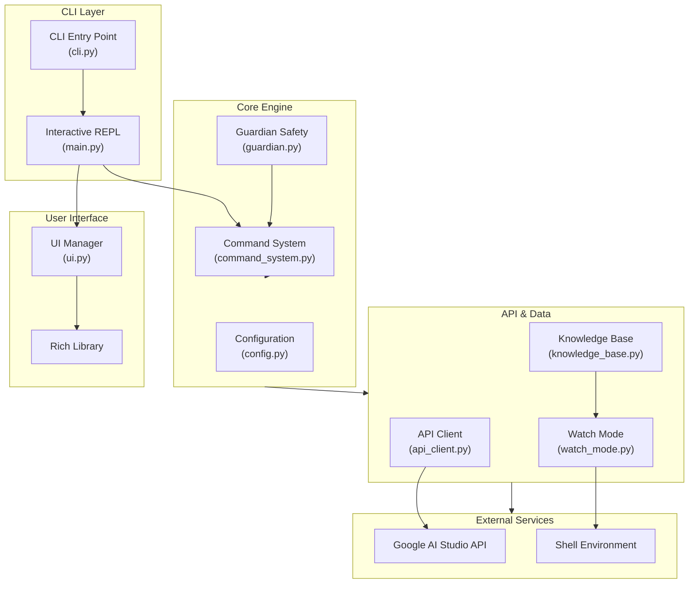

# ARIA Architecture

## System Overview

ARIA is built on a modular, multi-agent architecture designed specifically for Termux/Android development. Each component is independently testable and can be extended or replaced.

## Component Architecture



## Data Flow

### Command Execution Flow

```
User Input
    ↓
CLI Parser
    ↓
Command System
    ├→ Guardian Analysis
    │   ├→ Risk Scoring
    │   └→ User Confirmation (if needed)
    ↓
Command Handler
    ├→ /ask → API Client → Google AI API
    ├→ /fix → API Client → Google AI API
    ├→ /kb → Knowledge Base Search
    ├→ /watch → Watch Mode Activation
    └→ /config → Configuration Wizard
    ↓
Response Formatting
    ↓
UI Manager
    ├→ Syntax Highlighting
    ├→ Color Coding
    └→ Rich Output
    ↓
Display to User
```

### Error Detection & Fix Flow

```
Shell Output
    ↓
Watch Mode Monitor
    ↓
Error Pattern Detection
    ├→ Regex Matching
    └→ Fuzzy Search
    ↓
Knowledge Base Lookup
    ├→ Pattern Match
    ├→ Solution Retrieval
    └→ Auto-fix Check
    ↓
User Notification
    ├→ Error Description
    ├→ Suggested Solution
    └→ Auto-fix Option
    ↓
Auto-fix Execution (if enabled)
    ↓
Result Feedback
```

### API Self-Healing Flow

```
API Request
    ↓
Try Request
    ├→ Success → Return Response
    └→ Failure → Catch Exception
    ↓
Fetch Available Models
    ↓
Model Validation
    ├→ Current Model Available → Retry
    └→ Current Model Unavailable → Switch Model
    ↓
Exponential Backoff
    ├→ Attempt 1 (wait 1s)
    ├→ Attempt 2 (wait 2s)
    └→ Attempt 3 (wait 4s)
    ↓
Success → Return Response
Failure → Fallback Response
```

## Module Responsibilities

| Module | Responsibility | Key Features |
|--------|-----------------|--------------|
| `main.py` | Application core, command registration, REPL loop | Boot sequence, command execution, configuration |
| `cli.py` | Command-line interface | Click integration, CLI commands, argument parsing |
| `api_client.py` | Google AI API integration | Self-healing, retry logic, model switching, fallback |
| `command_system.py` | Slash command parsing and execution | Command registration, parsing, history, aliases |
| `config.py` | Configuration management | Load/save JSON, environment variables, validation |
| `guardian.py` | Safety layer and risk analysis | Risk scoring, pattern detection, user prompts |
| `knowledge_base.py` | Termux knowledge base | 100+ entries, fuzzy search, categorization |
| `watch_mode.py` | Shell monitoring and auto-fix | Error detection, solution lookup, auto-execution |
| `ui.py` | Terminal UI components | Rich integration, animations, formatting |
| `utils.py` | Utility functions | Termux detection, command execution, helpers |

## Configuration Architecture

```
~/.aria/
├── config.json          # User configuration
└── aria.log             # Application logs
```

### Configuration Schema

```json
{
  "api_key": "string",           // Google AI Studio API key
  "model": "string",             // LLM model name
  "temperature": "float",        // Generation temperature (0-1)
  "max_tokens": "integer",       // Maximum output tokens
  "watch_mode": "boolean",       // Enable watch mode by default
  "guardian_mode": "boolean",    // Enable safety layer
  "created_at": "ISO8601",       // Creation timestamp
  "updated_at": "ISO8601"        // Last update timestamp
}
```

## Knowledge Base Structure

```
Knowledge Base
├── Error Patterns (20+ entries)
│   ├── command_not_found
│   ├── permission_denied
│   ├── no_such_file
│   └── ...
├── Package Management (5+ entries)
│   ├── pkg_update
│   ├── pkg_search
│   └── ...
├── Proot-Distro (3+ entries)
│   ├── proot_install
│   └── ...
├── Android Bridge (6+ entries)
│   ├── battery
│   ├── clipboard
│   └── ...
└── Development (4+ entries)
    ├── python_venv
    ├── git_config
    └── ...
```

## Command Registration System

```python
# Commands are registered dynamically
command_system.register(
    name="ask",
    handler=cmd_ask,
    description="Ask the AI a question",
    aliases=["q", "query"],
    requires_args=True
)

# Execution flow
parsed = command_system.parse_command("/ask How to install Python?")
result = command_system.execute(parsed)
```

## API Integration

### Google AI Studio API

- **Base URL**: `https://generativelanguage.googleapis.com/v1beta`
- **Models**: gemma-4-2b-it, gemma-4-4b-it, gemma-4-26b-a4b-it, gemma-4-31b-it
- **Free Tier**: 15 requests/minute, 1500 requests/day
- **Authentication**: API key in header

### Self-Healing Mechanism

1. **Model Validation**: Check if current model is available
2. **Auto-Switch**: If unavailable, switch to first available model
3. **Retry Logic**: Exponential backoff (1s, 2s, 4s)
4. **Fallback**: Return offline response if all attempts fail

## Guardian Safety Layer

### Risk Scoring Algorithm

```
Base Score: 0

Pattern Matches:
- rm -rf: +50
- sudo: +30
- chmod 777: +20
- curl | sh: +10
- eval: +10

Final Score: MIN(sum, 100)

Confirmation Required: Score >= 40
```

### Risk Levels

| Level | Score | Action |
|-------|-------|--------|
| LOW | 0-20 | Execute immediately |
| MEDIUM | 21-50 | Show warning, execute with confirmation |
| HIGH | 51-80 | Show warning, require confirmation |
| CRITICAL | 81-100 | Show critical alert, require confirmation |

## Testing Architecture

```
tests/
├── test_api_client.py       # API client tests
├── test_command_system.py   # Command system tests
├── test_config.py           # Configuration tests
├── test_guardian.py         # Guardian tests
├── test_knowledge_base.py   # Knowledge base tests
└── test_watch_mode.py       # Watch mode tests
```

### Test Coverage

- **API Client**: Configuration, initialization, fallback
- **Command System**: Registration, parsing, execution, history
- **Configuration**: Load, save, validation, reset
- **Guardian**: Risk analysis, scoring, emoji/color generation
- **Knowledge Base**: Search, categorization, fuzzy matching
- **Watch Mode**: Error detection, solution lookup, auto-fix

## Performance Characteristics

| Operation | Typical Time | Notes |
|-----------|-------------|-------|
| Startup | <1s | Boot sequence animation |
| Command Parsing | <10ms | Regex-based parsing |
| KB Search | 10-50ms | Fuzzy matching on 100+ entries |
| API Request | 1-5s | Network dependent |
| Error Detection | <100ms | Pattern matching |
| Auto-fix Execution | Variable | Command dependent |

## Scalability Considerations

- **Knowledge Base**: Currently 100+ entries, easily extensible to 1000+
- **Commands**: Dynamic registration supports unlimited commands
- **API Calls**: Rate-limited by Google AI Studio (15 req/min free tier)
- **Logging**: Rotated logs prevent disk space issues
- **Configuration**: JSON-based, supports custom extensions

## Security Considerations

- **API Key**: Stored locally in `~/.aria/config.json` (user-readable)
- **Guardian Mode**: Prevents execution of dangerous commands
- **Input Validation**: Command parsing with proper escaping
- **HTTPS**: All API calls use HTTPS
- **No Remote Code Execution**: Commands are analyzed before execution

## Extension Points

### Adding New Commands

```python
def cmd_custom(args: str) -> str:
    """Custom command handler."""
    return f"Custom response: {args}"

aria.command_system.register(
    name="custom",
    handler=cmd_custom,
    description="Custom command",
    requires_args=True
)
```

### Adding Knowledge Base Entries

```python
kb.entries["custom_error"] = KBEntry(
    pattern="custom error pattern",
    solution="How to solve this error",
    auto_fixable=True,
    fix_command="fix command",
    category="custom"
)
```

### Custom API Integration

```python
# Extend APIClient for different LLM providers
class CustomAPIClient(APIClient):
    def generate_content(self, prompt, **kwargs):
        # Custom implementation
        pass
```

## Deployment Architecture

```
Installation
    ↓
pip install -e .
    ↓
Entry Point Registration
    ├→ aria (main command)
    ├→ aria ask
    ├→ aria fix
    └→ aria kb
    ↓
Configuration Wizard
    ↓
Ready for Use
```

---

**ARIA** — Modular, extensible, and designed for Termux. 🚀
